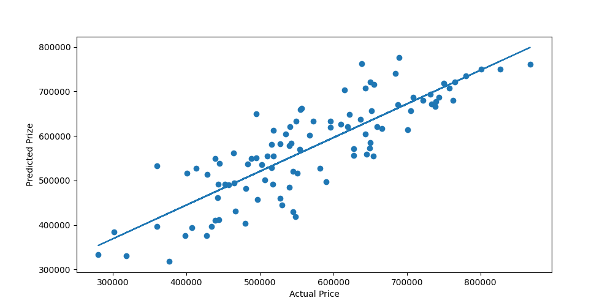

# House Price Prediction -- Linear Regression Report

## 📌 Dataset Columns

-   **Location_Score** -- Numerical score representing locality quality
-   **Num_Bathrooms** -- Number of bathrooms
-   **Num_Bedrooms** -- Number of bedrooms
-   **Num_Floors** -- Total floors in the house
-   **Square_Feet** -- Total area
-   **Price** -- Target variable (house price)
-   **totalrooms** -- Engineered: Num_Bathrooms + Num_Bedrooms
-   **twostore** -- Binary flag for \>1 floor
-   **estimated_floor_area_of_each_room** -- Square_Feet / totalrooms
-   **Bed_Floor_ratio** -- Num_Bedrooms / (Num_Floors + 1)

------------------------------------------------------------------------

## 📊 Model Used

### **Linear Regression**

The linear regression model attempts to fit the equation:

\[ Price = m_1 X_1 + m_2 X_2 + ... + m_n X_n + b \]

Where: - (X_i) are input features
- (m_i) are coefficients
- (b) is the intercept

------------------------------------------------------------------------

## 📈 Visualizations

### **1. Actual vs Predicted Price**

### **2. No Outliers Scatter Plot**

(Images are located in the same directory.)

------------------------------------------------------------------------

## 📉 Model Performance (Linear Regression)

The model results:

-   **MAE ≈ 57,700**
-   **RMSE ≈ 66,800**
-   **MSE ≈ \~4.46e9**

Since house prices range from **₹2,00,000 to ₹9,00,000**, this error is
significantly high---especially for lower‑priced houses.

------------------------------------------------------------------------

## 🧠 Final Conclusion

The final conclusion from this training is:

> **The current dataset is not rich enough for a linear model to perform
> well.
> Linear Regression is failing to capture the non‑linear relationships
> in housing prices.
> Models like *RandomForestRegressor*, *XGBoostRegressor*, Gradient
> Boosting, etc., combined with a more detailed dataset, will give
> significantly better performance.**

Linear regression underfits this data because: - House prices do not
follow a straight-line relationship
- Location, size, and bathrooms interact non‑linearly
- Important features like distance to city center, age of house,
amenities are missing

Thus, **tree-based models are recommended** for improved prediction
accuracy.

------------------------------------------------------------------------

